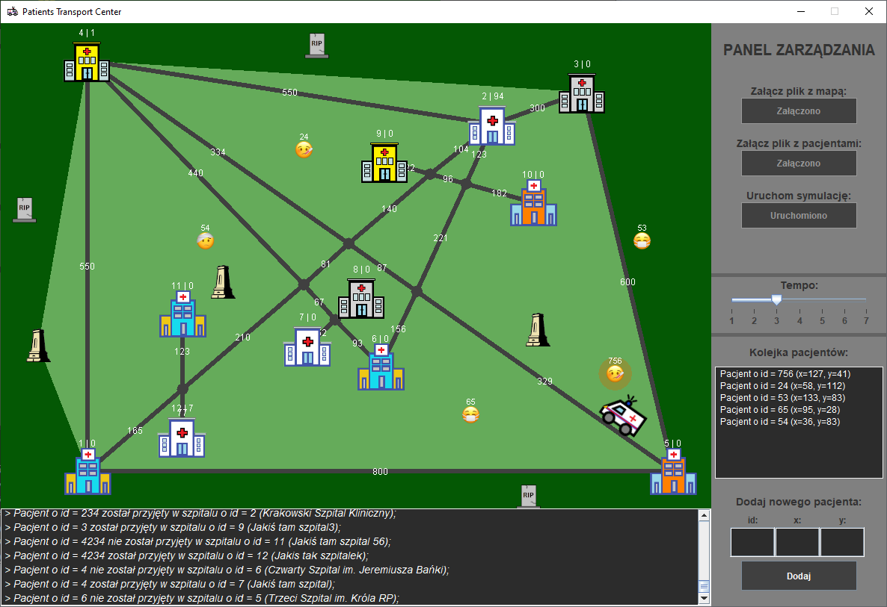
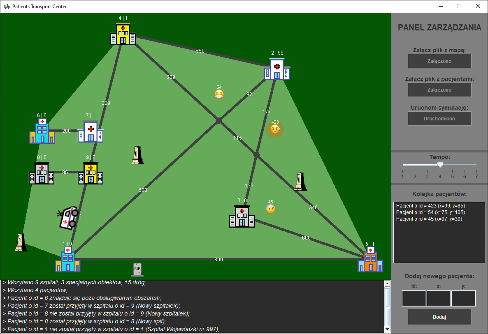

---

### Table of Contents
* [About](#about)
* [Motivation and project status](#motivation-and-project-status)
* [Technologies used](#technologies-used)
* [Requirements](#requirements)
* [Configuration](#configuration)
* [Setup and usage](#setup-and-usage)
* [Tests](#tests)
* [Screenshots](#screenshots)
* [Licence](#licence)

---

### About

PTC is a desktop application, which can help in optimizing the transport of patients to hospitals.

In the first step, an ambulance is moving the first patient in the queue to the nearest hospital. If there are some beds available then the patient is left there, if not then the patient is transported to another hospital - chosen by the lowest value (shortest time) marked on the road.

The ambulance provides transport only for patients in a specified area - a convex hull designated by hospitals and monuments.


The project uses a few of algorithms to work properly:
* <a href="https://en.wikipedia.org/wiki/Graham_scan">Graham Scan Algorithm</a> - finding the convex hull of a finite set of points (hospitals or monuments);
* <a href="https://en.wikipedia.org/wiki/Dijkstra%27s_algorithm">Dijkstra's algorithm</a> - finding the shortests paths beetween nodes in graph (beetween a patient and a hospital);
* <a href="https://en.wikipedia.org/wiki/Bentley%E2%80%93Ottmann_algorithm">Bentley–Ottmann algorithm</a> - listing all crossings in a set of line segments (detecing intersections).


---

### Motivation and project status

Patients transport center app was created during my second year of studying Computer Science in collaboration with Bartosz Zakrzewski & Antoni Malinowski. That was the group project for _Algorithms And Data Structures_ subject.

The project was completed successfully. 

Duration time: 26.11.2020 - 21.01.2021.

---

### Technologies used
* Java;
* Swing;
* Maven;
* Git;
* IntelliJ.

---

### Requirements

To run the game you need to have JRE 13 installed. 

To build a JAR by yourself you need also Maven.

---

### Configuration

You need to upload the configuration files in the main menu - you can use the exemplary files in `patients-transport-center-app/config` or create your own:

Examplary map-configuration file:

```txt
# Hospitals (id | name | x | y | number_of_beds | number_of_beds_available)
1 | Anderson Hospital | 10 | 10 | 1000 | 0
2 | Memorial Hospital | 100 | 120 | 999 | 99
3 | Mercy Hospital Fort Smith | 120 | 130 | 99 | 0
4 | St. Joseph's Hospital | 10 | 140 | 70 | 1
5 | Swedish Medical Center | 140 | 10 | 996 | 1
# Monuments (id | name | x | y)
1 | Chiricahua National Monument | -1 | 50
2 | Battle Hill Monument  | 110 | 55
3 | James Wolfe Monument  | 40 | 70
# Roads (id | hosp_id | hosp_id | time)
1 | 1 | 2 | 700
2 | 1 | 4 | 700
3 | 1 | 5 | 800
4 | 2 | 3 | 300
5 | 2 | 4 | 550
6 | 3 | 5 | 600
7 | 4 | 5 | 400
```

Examplary patients-configuration file:

```txt
# Patients (id | x | y)
1 | 20 | 20
2 | 99 | 105
3 | 23 | 40
```
You can also add patients in the GUI.

---

### Setup and usage

1.  Clone this repository:

    ```bash
    git clone git@github.com:wysockif/patients-transport-center-app.git
    ```

2.  Change your directory to `patients-transport-center-app/app` and build the JAR file:

    ```bash
    mvn clean install
    ```

3.  Run the application:

    ```bash
    java -jar target/patients-transport-center-app-1.0-SNAPSHOT.jar
    ```

    You can run it also by double-clicking.

---

### Tests

1. Run all (40) tests:

    ```bash
    mvn test
    ```
    The tests were created with JUnit 5 and AssertJ.

---

### Screenshots

* First exemplary map:


* Second exemplary map:


---

### License
Usage is provided under the [MIT License](http://opensource.org/licenses/mit-license.php). See LICENSE for the full details.